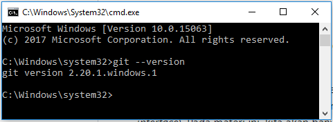
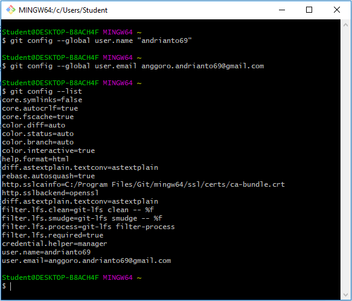
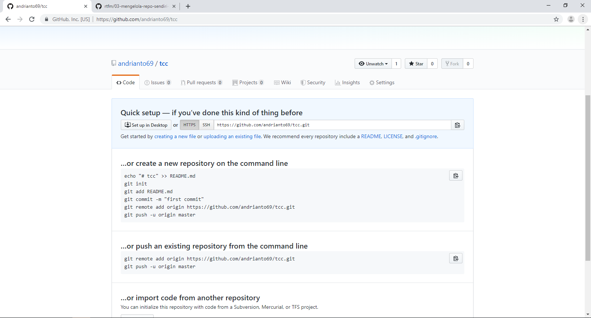
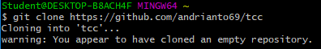

Listing Praktikum

1. Pada langkah pertama kita diarahkan untuk menginstal git dengan tutorial yang sudah disediakan. Namun pada PC praktikum sudah terdapat git-bash sehingga kita bisa dapat mengecek dengan cara membuka cmd kemudian mengetikan perintah seperti dibawah ini

2. Konfigurasi dilakukan untuk mencantumkan username dan email kita pada git, yaitu dengan cara menggunakan perintah seperti dibawah ini

3. Langkah selanjutnya adalah membuat repo sendiri dengan pilihan public. Jika repo sudah dibuat maka akan muncul tampilan seperti dibawah ini

Sehingga repo kita dapat diakses dengan alamat https://github.com/andrianto69/tcc.git
Kemudian clone repo kita ke komputer lokal dengan cara seperti dibawah ini

