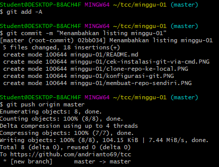
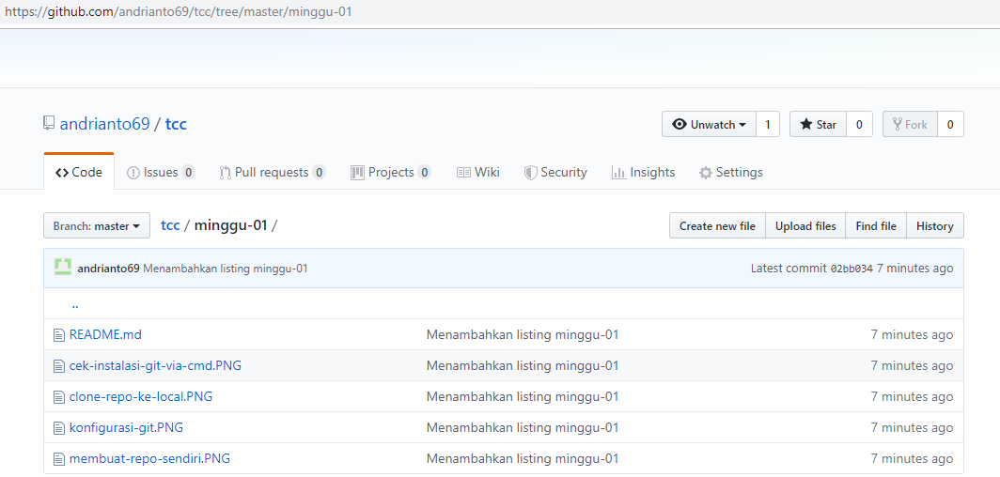
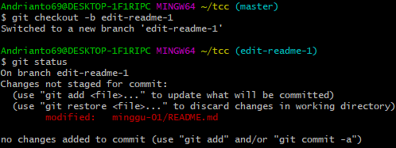

Listing Praktikum

## Menginstall git

1. Pada langkah pertama kita diarahkan untuk menginstal git dengan tutorial yang sudah disediakan. Namun pada PC praktikum sudah terdapat git-bash sehingga kita bisa dapat mengecek dengan cara membuka cmd kemudian mengetikan perintah seperti dibawah ini

## Konfigurasi git

1. Konfigurasi dilakukan untuk mencantumkan username dan email kita pada git, yaitu dengan cara menggunakan perintah seperti dibawah ini

## Mengelola Repo Sendiri di Account Sendiri

1. Langkah selanjutnya adalah membuat repo sendiri dengan pilihan public. Jika repo sudah dibuat maka akan muncul tampilan seperti dibawah ini

Sehingga repo kita dapat diakses dengan alamat https://github.com/andrianto69/tcc.git
Kemudian clone repo kita ke komputer lokal dengan cara seperti dibawah ini

berarti sekarang repo kita sudah terdapat pada direktori dalam komputer

2. Kemudian kita akan menambahkan file yang akan kita push dan memberikan komentar. Jika sudah siap maka file akan dipush

Jika berhasil, maka tampilan pada url git kita akan berubah menjadi seperti berikut

3. Setelah itu kita akan mencoba membuat brach untuk menampung perubahan perubahan dengan cara berikut

