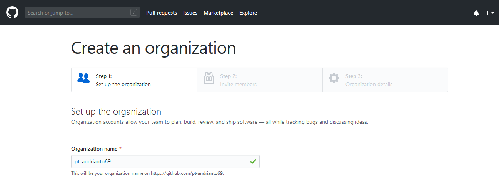

Listing Praktikum

## Mengelola repo organisasi

1. Sebelum membuat repo organisasi, pertama kita harus membuat organisasi terlebih dahulu agar nanti dapat digunakan sebagai author

2. Kemudian membuat repo dengan author organisasi kita tadi

