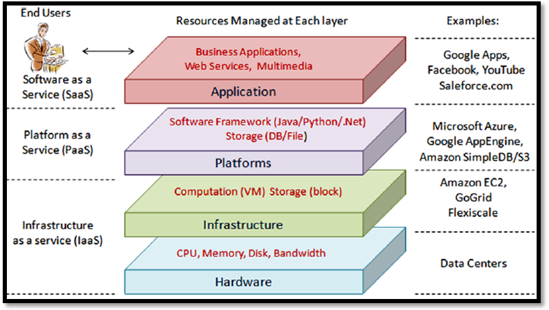

# SOFTWARE AS A SERVICE

## Pengertian
Software as a Service adalah salah satu jenis layanan cloud computing dimana kita bisa langsung menggunakan aplikasi yang telah disediakan. Penyedia layanan mengelola infrastruktur dan platform yang menjalankan aplikasi tersebut.

## Manfaat
1. Kita tinggal mendaftar layanan SaaS dan dengan cepat dapat langsung menggunakanan aplikasi bisnis yang inovatif.
2. Aplikasi dan data dapat diakses dari komputer yang sudah terhubung ke Cloud.
3. Tidak ada data yang hilang jika suatu saat terjadi hal yang tidak diinginkan pada komputer kita, karena data tersimpan pada Cloud.
4. Layanan SaaS umumnya mampu menyesuaikan secara dinamis dengan kebutuhan pemakaian.

## Contoh layanan SaaS
1. Google Apps seperti GMail, GDrive, GClassroom dll
2. Sosial Media seperti Facebook, Twitter, Instagram, dll
3. Situs Ecommerce seperti Tokopedia, Bukalapak, dll

# Arsitektur
Secara umum Arsitektur cloud computing dapat dibedakan kedalam 4 lapisan, yaitu lapisan perangkat keras (hardware), infrastruktur, platform, dan aplikasi

Dari gambar arsitektur diatas dapat diketahui Software as a Service terdapat pada lapisan paling atas dimana layanannya dapat langsung digunakan oleh End User.