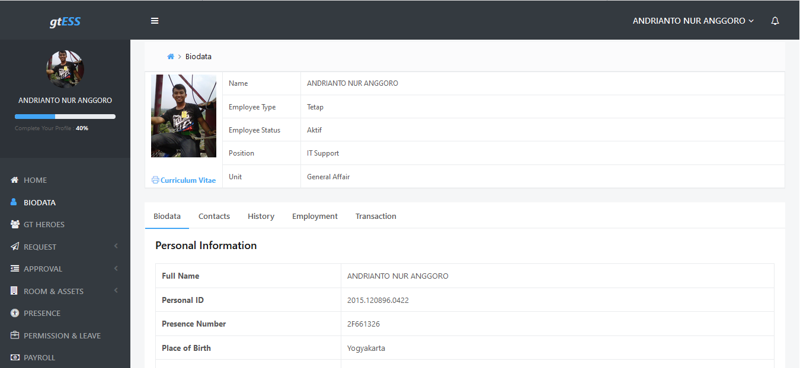

# BUSINESS PROCESS as a SERVICE

## Pengertian
BPaaS adalah istilah untuk jenis khusus layanan web-hosting atau cloud hosting yang menguntungkan perusahaan dengan membantu dengan tujuan bisnis. Dalam arti umum, proses bisnis hanyalah tugas yang harus diselesaikan untuk mendapatkan keuntungan operasi bisnis. Layanan ini umumnya meliputi Software sebagai Service (SaaS), Platform sebagai Layanan (PaaS), dan Infrastructure as a Service (IaaS) namun tergantung juga pada layanan terkait.

Istilah BPaaS dilipat ke dalam sejumlah ide berdasarkan pada jenis layanan yang disampaikan sebelumnya atau yang di-hosting di cloud. Salah satu yang paling awal adalah perangkat lunak sebagai layanan (SaaS). Dalam menyediakan perangkat lunak sebagai layanan, vendor menemukan bahwa mereka dapat membiarkan klien mengakses perangkat lunak melalui internet, daripada menjualnya dalam kotak di toko ritel konvensional dan membebankan biaya lisensi untuk pemasangan.

## Layanan BPaas dapat meliputi
1. ERP ( Enterprise resource planning ), yaitu Sistem Informasi yang diperuntukan bagi perusahaan manufaktur maupun jasa yang berperan mengintegrasikan dan mengotomasikan proses bisnis yang berhubungan dengan aspek operasi, produksi maupun distribusi di perusahaan yang bersangkutan.
2. CRM ( Customer Relationship Management ) adalah software sistem informasi yang membantu individu dan tim memaksimalkan komunikasi dengan pelanggan dan upaya penjualan mereka.
3. ESS ( Employee Self Services ) adalah portal yang dapat digunakan para karyawan untuk mengakses data human resource mereka. Data yang dapat diakses termasuk informasi pribadi dan jatah cuti. Selain itu, para karyawan juga dapat menggunakan ESS untuk menyampaikan request cuti, sakit atau izin kepada manajer mereka.

## Manfaat
1. Mempermudah pengelolaan proses bisnis pada sebuah perusahaan.
2. Mempermudah pengelolaan aset perusahaan seperti pengadaan, peminjaman dan inventaris.
3. Mempermudah layanan pada karyawan dan manajemen seperti presensi, cuti, lembur, perjalanan dinas dan lain-lain.
4. Bersifat cloud sehingga dapat diakses dimana saja dan kapan saja.

## Contoh Aplikasi BPaaS
### gtESS
gtESS adalah software yang memberikan kemudahan dalam pengelolaan data karyawan, pencatatan proses mutasi, penilaian kerja, penyederhanaan pengelolaan gaji dan penghitungan PPh (Pajak Penghasilan) serta melakukan rekapitulasi kehadiran karyawan. gtESS dibangun dengan tujuan agar pengelola perusahaan mengetahui kondisi karyawan dan pada akhirnya dapat mengambil keputusan yang tepat terkait dengan strategi SDM yang akan di terapkan pada perusahaan tersebut.
Software gtESS dirancang agar dapat mengelola database presensi karyawan, baik yang dilakukan dengan sistem barcode, fingerprint dan smartcard, dan kemudian mengintegrasikannya dengan sistem payroll karyawan. Kerumitan dalam penghitungan gaji dan mengetahui kapan karyawan habis kontrak, dapat diselesaikan dengan aplikasi ini.

### Contoh tampilan gtESS
Berikut adalah beberapa contoh tampilan pada gtESS

