# COCKROACH DATABASE

## Install Cockroach Databases dengan Docker
1. Sebelumnya pada laptop/komputer yang digunakan praktikum harus sudah terinstal Docker terlebih dahulu

2. Membuka windows powershell dan mengecek ketersediaan docker
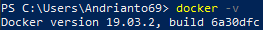

3. Mendownload cockroachdb terbaru dari docker hub
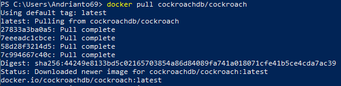

4. Mengecek docker image yang sudah terdownload tadi
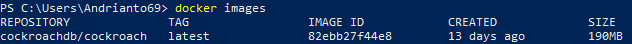

5. Jalankan container cockroachdb dengan perintah seperti di bawah ini
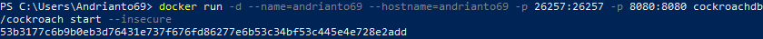

6. Cek container yang sedang berjalan

7. Kemudian masuk ke container andrianto69 yang sudah dibuat tadi
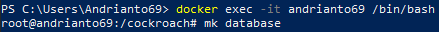

## Konfigurasi Cockroachdb
1. Create database
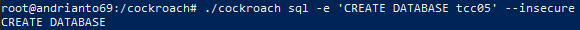

2. Show databases
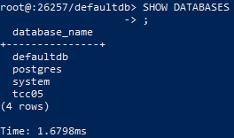

3. Create table
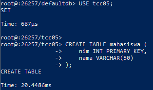

4. Insert table
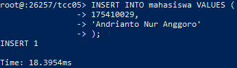

5. Show table
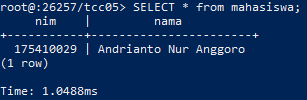

## Tampilan Dashboard CockroachDB
Berikut adalah beberapa tampilan dashboard dari cockroachDB yang sudah dibuat

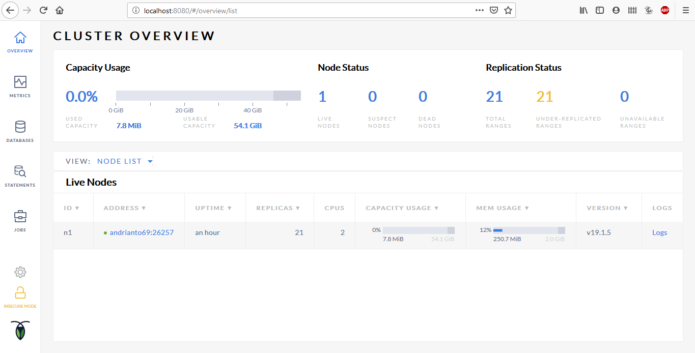

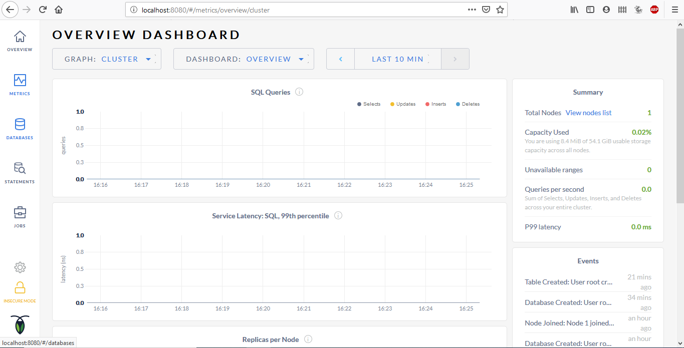

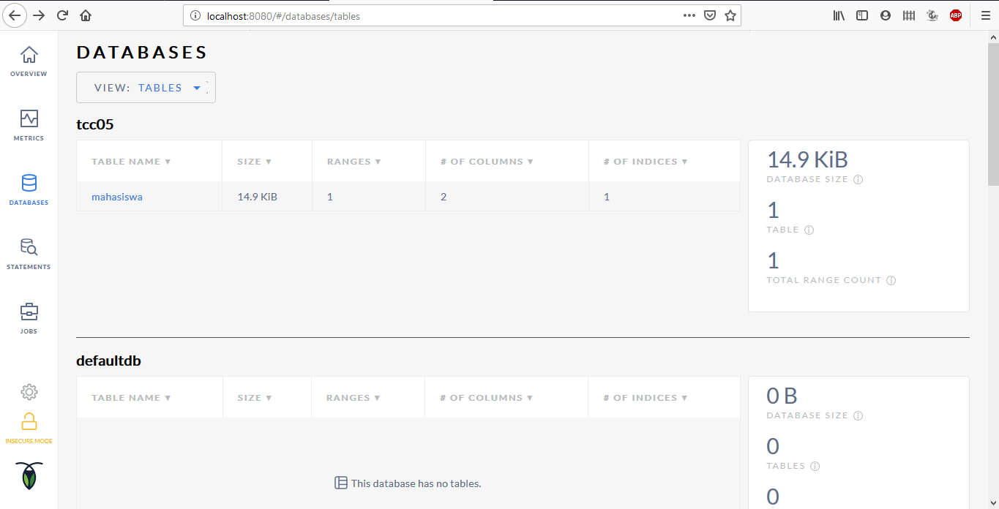