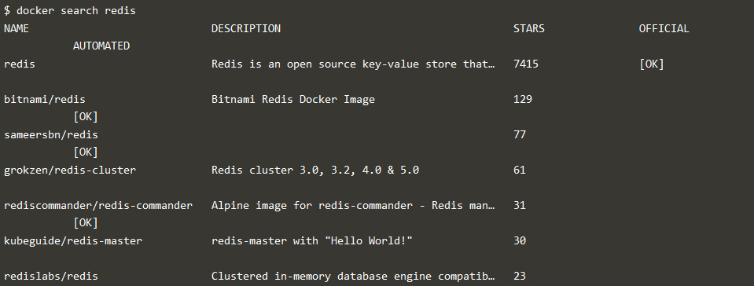

## Deploying Your First Docker Container
link https://www.katacoda.com/courses/docker/deploying-first-container

Pada praktikum ini kita akan dihadapkan dengan beberapa secenario menjalankan docker. Berikut akan saya singkat langkah-langkah yang ada dalam link tutorial diatas

1. Mengidentifikasi nama Docker image yang dikonfigurasikan untuk menjalankan redis. Pada image ini terdapat semua yang diperlukan untuk memulai proses, dan tidak memerlukan konfigurasi. Perintah dibawah ini berfungsi untuk menampilkan seluruh image yang mengandung nama redis

Kemudian untuk menjalankannya dibackground proses kita menggunakan perintah seperti ini

2. Kita dapat menlihat proses yang sedang berjalan di background task dengan cara mengetikan perintah

command dibawah memberikan detail lebih lanjut tentang container yang berjalan, seperti alamat IP.

command dibawah akan menampilkan log dari sebuah container

3. Redis tadi dapat kita jalankan pada background dengan nama redisHostPort di port 6379

4. Container yang sudah kita buat tadi dapat dijalankan lebih dari satu proses dengan cara memanfaatkan port yang tidak sedang digunakan oleh redis

5. Untuk menyimpan log dan data dari container image dapat menggunakan perintah seperti berikut

6. Menjalankan docker dengan bash ubuntu dapat dilakukan dengan cara seperti berikut
