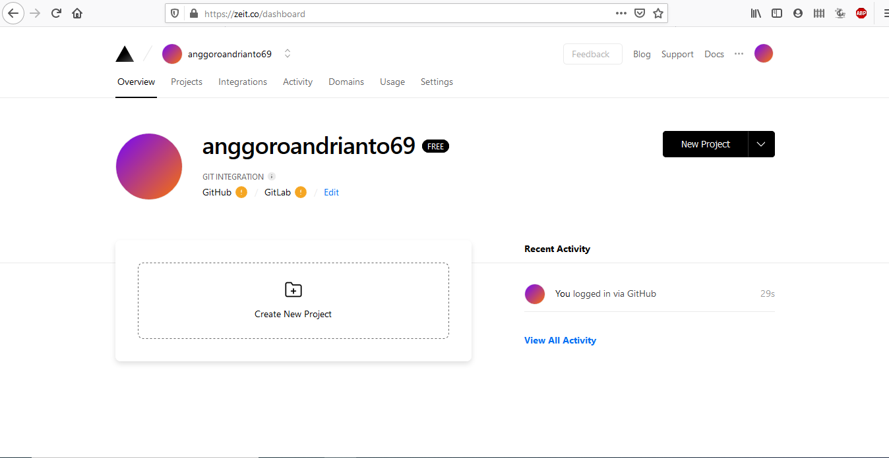

## ZEIT

### Login Zeit
buka zeit di https://zeit.co/ kemudian sign up dengan akun email, atau dapat menggunakan akun github

jika sudah dapat login maka tampilannya seperti ini

### Download dan Install Node Js
download https://nodejs.org/en/download/ kemudian install

Install node js dengan powershell

Login menggunakan bash

Buat project dengan next app

Mendeploy di now

Jika berhasil maka dapat diakses di https://next-project.anggoroandrianto69.now.sh/
