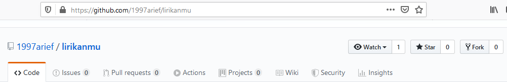
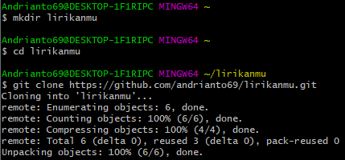
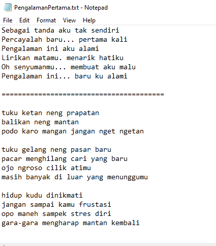
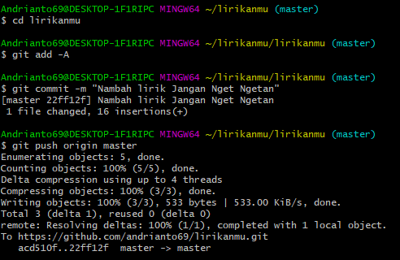
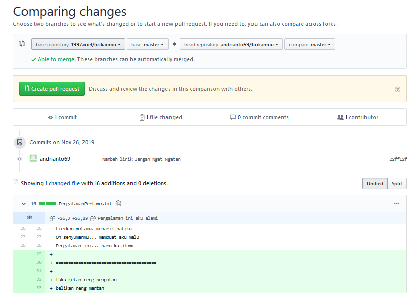
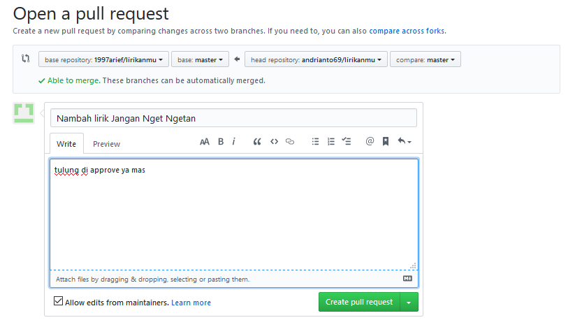
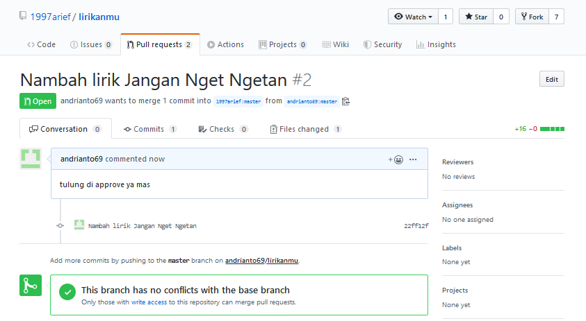
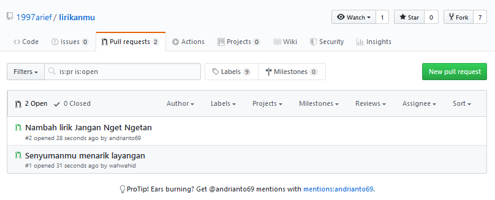
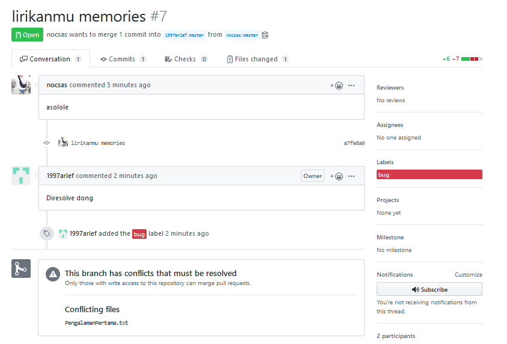

## KOLABORASI DENGAN GITHUB

1. Membuka repository di github dan lakukan fork
    

2. Membuat direktori lokal dan melakukan clone
    

3. Membuka file kemudian ikut menambahkan perubahan file didalamnya
    

4. Melakukan commit
    

5. Melihat perbandingan dengan file yang terdapat pada github
    

6. Membuat pull request baru
    

7. Melihat hasil pull, apakah terdapat conflik atau tidak. Jika tidak akan terdapat notifikasi jika tidak terdapat konflik
    

8. Daftar pull request
    

9. Jika terdapat konflik maka akan ditampilkan seperti gambar dibawah ini
    