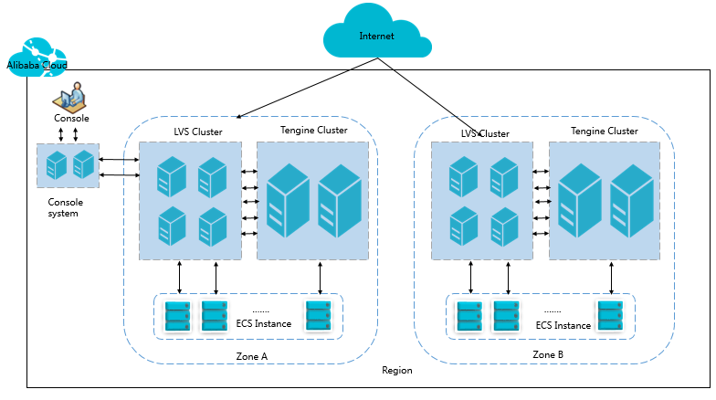

## INFRASTRUKTUR AS A SERVICES

### Konsep Dasar
IaaS (Infrastruktur as a Service) jika diartikan menurut bahasa Indonesia adalah memberikan Ingrastuktur sebagai sebuah layanan. Layanan cloud IaaS biasanya terdiri dari satu paket perangkat hardware komputer berupa virtualisasi, dengan jaringan internet, alamat IP dedicated, bandwitch, jaminan online secara realtime (koneksi ke internet secara kontinyu) serta keamanan. Provider menyediakan layanan dengan berbagai spesifikasi, yakni CPU, RAM serta Storage dalam bentuk virtualisasi.

### Software IaaS
Terdapat beberapa layanan IaaS yang dapat digunakan yaitu :
 * Amazon EC2
 * Digital Ocean
 * Rackspace
 * Alibaba Cloud ECS

### Getting Started Iaas

### Arsitektur dan Konsep Deployment
Architecture Alibaba Cloud  

Topik ini menjelaskan arsitektur Server Load Balancer (SLB). SLB digunakan dalam cluster, yang memungkinkan sinkronisasi sesi dan mengurangi pembuatan SPOF di server backend. Sebagai layanan penerusan lalu lintas, SLB meneruskan permintaan dari klien ke server backend melalui cluster SLB, dan server backend mengembalikan respons ke SLB melalui intranet.