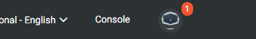

## INFRASTRUKTUR AS A SERVICES

### Konsep Dasar
IaaS (Infrastruktur as a Service) jika diartikan menurut bahasa Indonesia adalah memberikan Ingrastuktur sebagai sebuah layanan. Layanan cloud IaaS biasanya terdiri dari satu paket perangkat hardware komputer berupa virtualisasi, dengan jaringan internet, alamat IP dedicated, bandwitch, jaminan online secara realtime (koneksi ke internet secara kontinyu) serta keamanan. Provider menyediakan layanan dengan berbagai spesifikasi, yakni CPU, RAM serta Storage dalam bentuk virtualisasi.

### Software IaaS
Terdapat beberapa layanan IaaS yang dapat digunakan yaitu :
 * Amazon EC2
 * Digital Ocean
 * Rackspace
 * Alibaba Cloud ECS

### Getting Started Iaas
#### Membuat akun di alibabacloud
1. Akses link www.alibabacloud.com/campaign/free-trial dan klik Free Account.

2. Setelah itu buat akun dengan mengisi form yang sudah tersedia.

3. Kemudian isi kode verifikasi yang sudah dikirimkan ke email anda.

4. Setelah itu isi lagi form yang tersedia secara lengkap

5. Lalu isi verifikasi untuk no HP

6. Kemudian isi metode pembayaran yang anda inginkan

#### Mencoba produk dengan layanan free trial
1. Pastikan kita masuk ke akun Alibaba Cloud Anda dan menuju 

[link ini](https://www.alibabacloud.com/campaign/free-trial)

2. Scroll kebawah pada Free Trial Detail area dan pilih instansi targetnya. Klik Try Now

3. Kemudian akan muncul tampilan di mana kita dapat mengatur opsi konfigurasi ECS

4. Ketika kita sudah yakin dengan konfigurasi ECSnya, checklist pada "accept the Terms and Conditions and terms, kemudian klik Try Now.

5. VM kita akan disiapkan dan tersedia di Console Alibaba. Untuk melihat Console, klik saja tautan Console di kanan atas layar

6. Pada tampilan utama, pilih Eleastic Compute Service

7. Ini akan menampilkan ECS Console, di mana kita akan melihat gambaran umum dari instance saat ini. Klik Instance pada menu sebelah kiri.

8. Selanjutnya, kita akan melihat detail dari instance, dan setiap instance yang sudah ada yang mungkin akan kita atur.

### Arsitektur dan Konsep Deployment

VM (virtual machine) merupakan sebuah sistem operasi atau aplikasi yang diinstall pada hypervisor dan memiliki fungsi layaknya perangkat fisik (hardware) atau bisa juga disebut sebagai duplikat dari komputer asli.

Menurut Technopedia virtualisasi adalah sebuah proses pembuatan sesuatu yang awalnya berbentuk fisik menjadi berbentuk software atau virtual. misalnya sebuah sistem operasi, server dan alat penyimpanan dan perangkat jaringan. Software yang digunakan untuk virtualisasi dinamakan hypervisor. Software ini digunakan untuk membuat dan mengatur virtual machine.

Selain itu, hypervisor juga dapat berperan sebagai agen penghubung antara VM dengan perangkat fisik. Hypervisor dibagi menjadi dua jenis yaitu hypervisor tipe 1, tipe ini berjalan langsung diatas perangkat keras dan hypervisor tipe 2, tipe ini berjalan diatas host os contoh dari tipe ini adalah oracle virtualbox dan vmware workstation sedangkan untuk tipe 1 adalah vsphere dan citrix xen server. Hypervisor dapat menjalankan perangkat lunak apa pun yang berjalan pada perangkat keras bare metal sementara menyediakan isolasi dari perangkat keras yang sebenarnya.