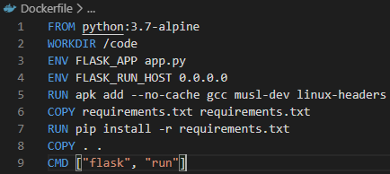

## DOCKER COMPOSE

### Step 1: Setup
1. Membuat direktory minggu-12
2. Membuat file app.py

3. Membuat file dengan nama requirements.txt

### Step 2: Create Dockerfile
1. Membuat dockerfile

### Step 3: Define services in a Compose file
1. Membuat file docker-compose.yml

### Step 4: Build and run your app with Compose
1. Pada directory project yang dikerjakan, mulai aplikasi dengan mengetikan "docker-compose up".

2. Jalankan https://localhost:5000 pada browser

3. Refresh halaman browser, maka jumlah angka akan berubah sesuai berapa kali view

4. Untuk melihat local image dapat dicek dengan menggunakan command seperti dibawah

5. Untuk menghentikan aplikasi dapat menggunakan command "docker-compose down" atau menggunakan tombol "Ctrl+C".

### Step 5: Edit the Compose file to add a bind mount
1. Edit docker-compose.yml kemudian tambahkan bind mount untuk webservice

### Step 6: Re-build and run the app with Compose
1. Jalankan kembali dengan menggunakan "docker-compose up", maka akan muncul permintaan akses dengan memasukan login dari windows

2. Akses kembali https://localhost:5000 pada browser

### Step 7: Update the application
1. Edit file app.py kemudian ganti pesan dengan berikut ini

2. Refresh halaman pada docker
