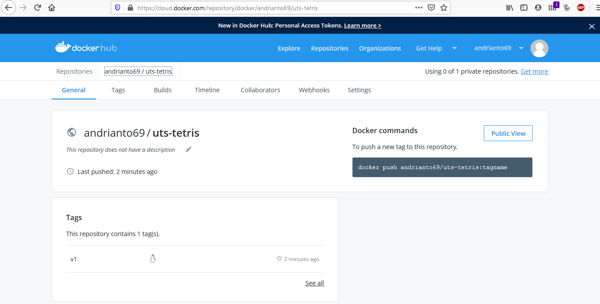

## Ujian Tengah Semester Teknologi Cloud Computer

### Menclone aplikasi yang ingin kita buat

### Membuat Dockerfile

### Build image dari Dockerfile

### Melihat Docker image yang sudah kita buat tadi

### Menjalankan image docker yang sudah dibuat

### Melihat image docker yang sedang running

### Menjalankan aplikasi dengan menggunakan browser

### Push ke dalam Docker Hub
Login

Push

### Jika berhasil maka dapat dilihat pada hub.docker.com
https://cloud.docker.com/repository/docker/andrianto69/uts-tetris

